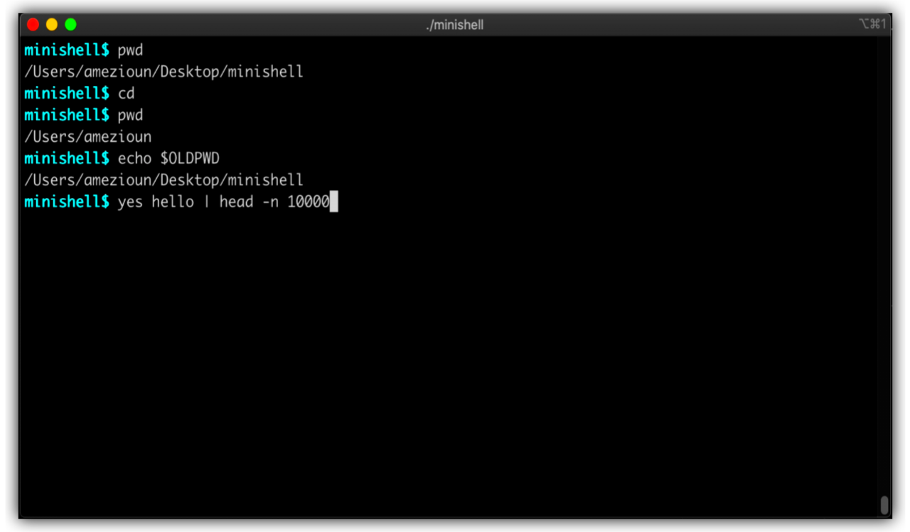

# Minishell  

A simple shell built in C that replicates basic Bash functionality.


---

## Core Functions  

### 1. `main_loop`  

The `main_loop` function is the main control of the shell. It continuously waits for user input, and tokenizes it.

```c
void	main_loop(t_env **env)
{
	t_token	*token_list;

	token_list = NULL;
	while (1)
	{
		read_and_tokenize(env, &token_list);
		if (token_list)
		{
			main_process(env, token_list);
			ft_tokens_free(token_list);
			token_list = NULL;
		}
	}
}
```

- **Purpose**:  
  - **Input Handling**: The loop waits for user input in `read_and_tokenize`, which converts the input into a linked list of tokens.


- **Token Structure**:
  - Tokens represent parsed elements of the user input, including commands, arguments, operators, pipes, exit status($?), and redirections.

```c
typedef enum e_token_type
{
	WORD,
	S_QUOTE,
	D_QUOTE,
	SPACES,
	ENV,
	PIPE,
	RED_IN,
	RED_OUT,
	RED_APP,
	HERE_DOC,
	EXIT_STATUS
}						t_token_type;

typedef struct s_token
{
	char				*value;
	t_token_type		type;
	struct s_token		*next;
}						t_token;
```

---

### 2. `main_process`

The `main_process` function is responsible for transforming the list of tokens into a list of commands, setting paths, and sending the commands to the executor.

```c
void	main_process(t_env **env, t_token *token_list)
{
	t_command	*cmd;

	cmd = NULL;
	if (token_list)
	{
		cmd = fill_command(token_list, *env);
		if (cmd)
		{
			set_path(&cmd);
			execution(&cmd, env);
			free_cmd(cmd);
			cmd = NULL;
		}
	}
}
```

- **Purpose**:  
  - After checking for syntax errors (such as mismatched quotes, redirections, and pipes), the `fill_command` function converts the token list into a list of commands. Each command has its own list of redirections.
  
```c
typedef struct s_command
{
	char				*name;
	char				**args;
	char				*path;
	t_red				*in;
	t_red				*out;
	int					fd;
	struct s_command	*next;
}
```

- After building the commands list, it is passed to the execution function for further processing. 

## Run
```sh
git clone https://github.com/AchrafMez/minishell.git
cd minishell
make
./minishell
```

---

- This project was made with the collaboration of [@battagi](https://github.com/battagi).
